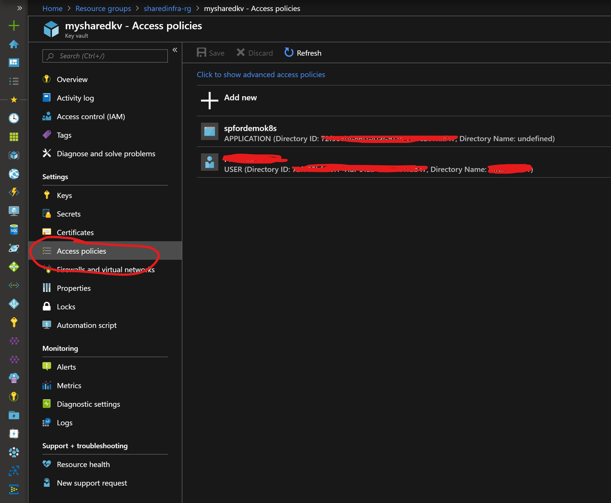

## Create Azure KeyVault

>Explore contents of kvDeploy & kvDeploy.param.json in your favourite editor. Edit parameter values in kvDeploy.param.json as needed. \
>This template has two access policies:
>-   One for giving full access to yourself and
>-   Second for a limited access to your application.
>
>Policies can be added or removed both at the time of KeyVault creation or anytime later. Modify them as per your need.

**Find your object ID**

PowerShell

    (Get-AzADUser -UserPrincipalName 'your_email_id').Id

Bash:

    az ad user show --upn 'your_email_id' --query 'objectId'

**Setup deployment variables for Azure KeyVault:**
>Change templatePath and other values as per your environment

PowerShell:

    $location = 'eastus'
    $resourceGroupName = 'sharedinfra-rg'
    $resourceDeploymentName = 'kvdeploy'
    $templatePath = $env:SystemDrive + '\' + 'users' + '\' + 'demouser'
    $templateFile = 'kvDeploy.json'
    $templateParameterFile = 'kvDeploy.param.kv.json'
    $template = $templatePath + '\' + $templateFile
    $templateParameter = $templatePath + '\' + $templateParameterFile

Bash:

    location='eastus'
    resourceGroupName='sharedinfra-rg'
    resourceDeploymentName='kvDeploy'
    templatePath=$HOME/demouser
    templateFile=kvDeploy.json
    templateParameterFile=kvDeploy.param.json
    template=$templatePath/$templateFile
    templateParameter=$templatePath/$templateParameterFile

**Create Resource Group if it's not already there:**\
PowerShell:

    New-AzResourceGroup `
     -Name $resourceGroupName `
     -Location $location `
     -Verbose -Force

Bash:

    az group create --name $resourceGroupName --location $location

**Create Azure KeyVault:**\
PowerShell:

    New-AzResourceGroupDeployment `
     -Name $resourceDeploymentName `
     -ResourceGroupName $resourceGroupName `
     -TemplateFile $template `
     -TemplateParameterFile $templateParameter `
     -Verbose -Force

Bash:

    ```az group deployment create \
    --name $resourceDeploymentName \
    --resource-group $resourceGroupName \
    --template-file $template \
    --parameters @$templateParameter \
    --no-wait ```

>Once KeyVault is created successfully, browse the resource on Azure portal and verify that the access policies there matches what you had specified in the template. Here is a snapshot of how it'll look like:




<br>
<br>
<br>
<br>

---